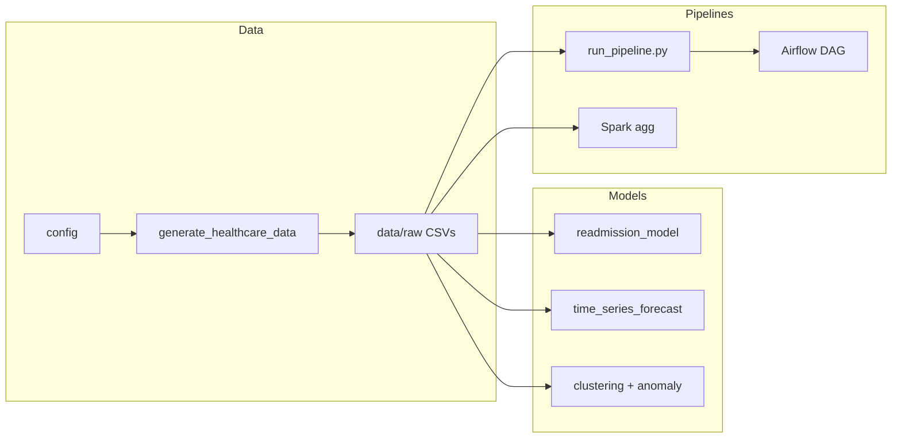

# Healthcare Analytics Portfolio

[](https://github.com/prendleman/tiger-analytics-portfolio/actions/workflows/tests.yml) [](https://opensource.org/licenses/MIT)

Portfolio project demonstrating **Lead Data Scientist** skills: Python and R, ML (classification, time series, clustering, anomaly detection), complex SQL, dimensional/relational data modeling, and healthcare-domain analytics. Aligned with roles in analytics consulting (e.g. Tiger Analytics) and healthcare/life sciences.

**What's inside:** Synthetic healthcare data (patients, encounters, claims, diagnoses, labs, readmissions), config-driven generation, readmission prediction (Random Forest + GridSearchCV), PMPM time series forecasting (SARIMA, Prophet, exponential smoothing), clustering and anomaly detection, SQL feature/reporting scripts, and pipeline/MLOps examples (orchestration script, Airflow DAG, Spark job). See [docs/DESIGN.md](docs/DESIGN.md) for design overview and data flow.

## Quick start

```bash
git clone https://github.com/prendleman/tiger-analytics-portfolio.git
cd tiger-analytics-portfolio
pip install -r requirements.txt
python scripts/run_demo.py   # ~1–2 min: generate demo data + run readmission + time series
```

Then open the notebooks in `notebooks/python/` or run the full pipeline with `python pipelines/run_pipeline.py` (use `--skip-data` if you already have data in `data/raw/`). On a system with `make`: `make install && make demo` (or `make data-demo` then `make pipeline`).

**Docker (reproducible run):** `docker build -t tiger-portfolio .` then `docker run --rm tiger-portfolio` runs the demo (data gen + readmission + time series) in a single environment. See [Docker](#docker) below.

## Architecture



## Skills mapped to JD

| JD requirement | Where demonstrated |
|----------------|--------------------|
| **Python & R** | Python: data generation, readmission model, EDA notebook. R: descriptive analytics and visualization (Rmd + script). |
| **Machine learning** | 30-day readmission classification (Random Forest); **time series / PMPM forecasting** (SARIMA, exponential smoothing on claims/cost); **clustering** (KMeans); **anomaly detection** (Isolation Forest). Model evaluation: MAPE, RMSE. |
| **Complex SQL** | `sql/feature_readmission.sql` (joins, CTEs, aggregations); `sql/report_utilization_kpis.sql` (reporting KPIs). |
| **Dimensional / relational modeling** | `data/schema/ddl.sql` and `data/schema/README.md`: star-style relationships, reference tables, data dictionary, ER overview. |
| **Healthcare / pharma domain** | Mock schema and data: patients, encounters, diagnoses, procedures, medications, labs, claims, readmissions, risk scores. |
| **Reproducibility & communication** | README, `docs/methodology.md`, requirements.txt, clear paths and run instructions. |
| **MLOps / pipelines** | `pipelines/run_pipeline.py` (orchestration); `pipelines/dag_airflow_example.py` (Airflow DAG); `src/python/spark_claims_agg.py` (PySpark). Scripts and DAG are designed to plug into production schedulers (Airflow, Databricks). |

## Repository structure

```
README.md                 # This file
data/
  raw/                     # Generated CSVs (run generator first)
  schema/                 # DDL, data dictionary, ER (see schema/README.md)
notebooks/
  python/                  # Jupyter: readmission; time series/PMPM forecasting; clustering & anomaly detection
  r/                       # R Markdown: descriptive analytics & viz
src/
  python/                  # Data generation, readmission model script
  r/                       # R script: EDA summary
sql/                       # Feature table, PMPM summary, utilization KPIs
pipelines/                 # Orchestration + Airflow DAG example
config/                    # config.yaml (full), demo.yaml (quick run)
scripts/                   # run_demo.py, push_to_github.ps1
tests/                     # pytest: data generation, readmission model
docs/                      # Methodology, design overview, limitations
requirements.txt
LICENSE
```

## Setup and run

### 1. Environment

```bash
cd tiger-analytics-portfolio
pip install -r requirements.txt
```

*(Requirements are pinned for reproducibility. To update: edit `requirements.in`, then `pip install pip-tools && pip-compile requirements.in -o requirements.txt`. See [CONTRIBUTING.md](CONTRIBUTING.md).)*

### 2. Generate mock data

Output is written to `data/raw/` (CSVs). Use **demo config** for a quick run (~1 min), or default for full scale.

```bash
# Quick demo (1k patients, 5k encounters)
python src/python/generate_healthcare_data.py --config config/demo.yaml

# Full scale (50k patients, 200k encounters, ~8 min)
python src/python/generate_healthcare_data.py
# Or: python src/python/generate_healthcare_data.py --config config/config.yaml
```

### 3. Python: readmission model

```bash
python src/python/readmission_model.py
```

Or open and run `notebooks/python/readmission_prediction.ipynb` (Jupyter).

**Overview:** `notebooks/python/00_overview.ipynb` — intro and links to all notebooks.  
**Time series & PMPM forecasting:** `notebooks/python/time_series_pmpm_forecasting.ipynb` — member-month aggregates from claims, SARIMA and exponential smoothing, MAPE/RMSE evaluation.  
**Clustering & anomaly detection:** `notebooks/python/clustering_anomaly_detection.ipynb` — KMeans encounter segments, Isolation Forest for outlier encounters.

### 4. R: descriptive analytics

From repo root:

```bash
Rscript src/r/healthcare_eda.R
```

Or knit `notebooks/r/healthcare_eda.Rmd` to HTML (RStudio or `rmarkdown::render()`).  
**R readmission model:** `Rscript src/r/readmission_model_r.R` — logistic regression for 30-day readmission (mirrors Python model).

### 5. Pipeline (MLOps-style)

Run the full workflow from repo root (optional: skip data gen if `data/raw/` already exists):

```bash
python pipelines/run_pipeline.py              # data gen + readmission + time series
python pipelines/run_pipeline.py --skip-data   # use existing data
```

**Airflow:** Copy `pipelines/dag_airflow_example.py` into your DAGs folder; set `REPO_ROOT` to the repo path. Requires `apache-airflow`.

**Databricks:** Notebooks and scripts run as-is on Databricks (Python / Spark); use the same paths or mount the repo.

**Spark:** Claims aggregation by month (PMPM-style) with PySpark. Requires `pyspark`. From repo root:

```bash
pip install pyspark
spark-submit src/python/spark_claims_agg.py
```

Output: `data/processed/claims_by_month/` (parquet).

### 6. SQL

- Load schema: run `data/schema/ddl.sql` in your database (SQL Server or PostgreSQL).
- Load CSVs into the tables (bulk insert or ETL), then run:
  - `sql/feature_readmission.sql` — encounter-level feature set for ML/reporting.
  - `sql/monthly_pmpm_summary.sql` — monthly PMPM aggregates (SQL Server); `monthly_pmpm_summary_pg.sql` for PostgreSQL.
  - `sql/report_utilization_kpis.sql` — utilization and cost by facility and payer.

### 7. Data validation

After generating data, check referential integrity and row counts:

```bash
python src/python/validate_data.py --data-dir data/raw
```

### 8. Tests

```bash
# Generate demo data first, then:
pytest tests/ -v
```

### 9. Docker

One-command reproducible run (no local Python install required):

```bash
docker build -t tiger-portfolio .
docker run --rm tiger-portfolio
```

This generates demo data and runs the readmission and time series scripts inside the container. To explore interactively: `docker run --rm -it tiger-portfolio /bin/bash`, then run `python scripts/run_demo.py` or individual scripts.

## Data summary

- **Reference**: facility types, specialties, ICD/CPT/NDC codes.
- **Core**: patients, encounters, diagnoses, procedures, medications, labs, vitals.
- **Utilization**: claims, claim lines, utilization events.
- **Outcomes**: readmissions (30-day flag), adverse events, risk scores.

See `data/schema/README.md` for the full data dictionary and ER diagram.

## Methodology and limitations

- **Methodology**: `docs/methodology.md` — target definition, features, model choice, and reproducibility notes.
- **Design**: `docs/DESIGN.md` — data flow, design decisions, and trade-offs.
- **Model card**: `docs/MODEL_CARD.md` (readmission), `docs/MODEL_CARD_TIMESERIES.md` (PMPM forecasting).
- **Docs index**: [docs/README.md](docs/README.md) — links to all documentation. **Executive summary**: [docs/EXECUTIVE_SUMMARY.md](docs/EXECUTIVE_SUMMARY.md) — one-page stakeholder overview. **Results**: [docs/RESULTS.md](docs/RESULTS.md) — typical metrics on demo data.
- **Changelog**: [CHANGELOG.md](CHANGELOG.md). **Citing**: [CITATION.cff](CITATION.cff). **Security**: [SECURITY.md](SECURITY.md).
- **Troubleshooting**: [docs/TROUBLESHOOTING.md](docs/TROUBLESHOOTING.md) — common issues. **Contributing**: [CONTRIBUTING.md](CONTRIBUTING.md).
- **Export notebooks to HTML**: `python scripts/export_notebooks.py` (writes to `docs/notebooks/`; requires `nbconvert`).
- **Limitations**: Data is synthetic (Faker + pandas); not for clinical or production use. Models are for portfolio demonstration only.

## Resume

Resume available on request.
