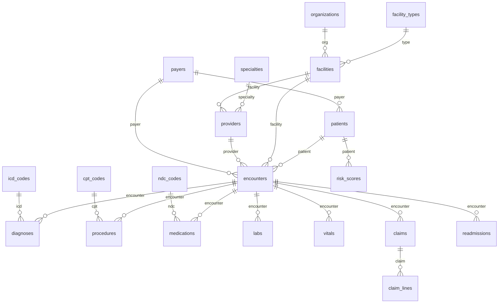

# Healthcare Mock Data Schema

## Entity relationship overview

## Table summary

| Area | Table | Description |
|------|--------|-------------|
| **Reference** | facility_types | Type of facility (hospital, clinic, etc.) |
| | specialties | Provider specialty (cardiology, internal medicine, etc.) |
| | icd_codes | ICD-10 diagnosis codes |
| | cpt_codes | CPT procedure codes |
| | ndc_codes | National Drug Code |
| **Organizations** | organizations | Health system / org hierarchy |
| | payers | Payer (commercial, Medicare, Medicaid) |
| | facilities | Facilities with type and location |
| | providers | Providers with specialty and facility |
| **Core clinical** | patients | Demographics, DOB, gender, race, payer |
| | encounters | Visits (inpatient, outpatient, ED) with admit/discharge |
| | diagnoses | Encounter diagnoses (ICD) with primary flag |
| | procedures | Encounter procedures (CPT) |
| | medications | Medications (NDC) per encounter |
| | labs | Lab results (code, value, unit, date) |
| | vitals | Vitals (type, value, timestamp) |
| **Utilization** | claims | Claim header (total charge/paid, status) |
| | claim_lines | Claim line items (CPT, charge, paid, units) |
| | utilization_events | Event log for utilization KPIs |
| **Outcomes** | readmissions | 30-day readmission flag and days to readmit |
| | adverse_events | Adverse events per encounter |
| | risk_scores | Patient risk scores (model, value, tier) |

## Data dictionary (key columns for ML/reporting)

### patients
| Column | Type | Description |
|--------|------|-------------|
| patient_id | VARCHAR(20) | PK |
| date_of_birth | DATE | For age calculation |
| gender | VARCHAR(10) | M/F/Other |
| race, ethnicity | VARCHAR(50) | Demographics |
| zip | VARCHAR(10) | Geography |
| payer_id | FK | Payer mix |

### encounters
| Column | Type | Description |
|--------|------|-------------|
| encounter_id | VARCHAR(20) | PK |
| patient_id | FK | Link to patients |
| facility_id, provider_id | FK | Attribution |
| encounter_type | VARCHAR(50) | inpatient, outpatient, emergency |
| admit_date, discharge_date | TIMESTAMP | LOS = discharge - admit |
| payer_id | FK | Payer at encounter |

### diagnoses
| Column | Type | Description |
|--------|------|-------------|
| encounter_id | FK | Link to encounter |
| icd_code | FK | Diagnosis code |
| is_primary | SMALLINT | 1 = primary diagnosis |

### labs
| Column | Type | Description |
|--------|------|-------------|
| encounter_id, patient_id | FK | Link |
| lab_code, lab_name | VARCHAR | Lab type |
| result_num, result_unit | DECIMAL, VARCHAR | Numeric result |
| result_date | TIMESTAMP | Time-series |

### readmissions (ML target)
| Column | Type | Description |
|--------|------|-------------|
| encounter_id | FK | Index encounter |
| index_discharge | TIMESTAMP | Discharge that led to readmit |
| readmit_date | TIMESTAMP | Readmission date |
| days_to_readmit | INT | Target for regression |
| is_30_day | SMALLINT | Binary target (1 if ≤30 days) |

### claims / claim_lines
| Column | Type | Description |
|--------|------|-------------|
| total_charge, total_paid | DECIMAL | Cost KPIs |
| charge_amt, paid_amt | DECIMAL | Line-level cost |

## ML use cases supported

- **30-day readmission prediction**: Target `readmissions.is_30_day`; features from patients, encounters (LOS, type), diagnoses (comorbidity counts), labs, prior utilization.
- **Length of stay**: Target derived from `encounters.discharge_date - admit_date`; features from demographics, diagnoses, procedures, payer.
- **High-cost prediction**: Target from `claims.total_paid` or `total_charge`; features from encounter type, procedures, facility, payer.

Data is generated with plausible distributions and referential integrity; see `src/python/generate_healthcare_data.py` and `data/raw/`.
