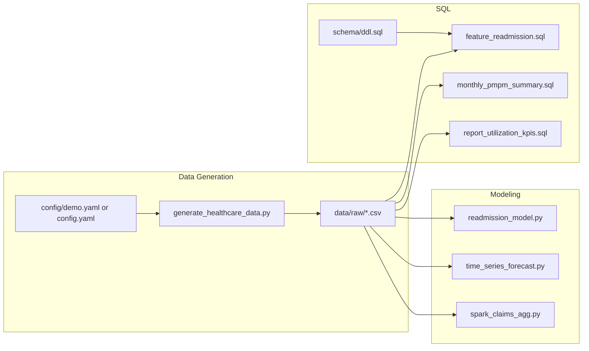

# Design Overview

## Goals

- Demonstrate **Lead Data Scientist** skills end-to-end: data generation, modeling, SQL, pipelines, and documentation.
- Use a single **healthcare** domain (claims, utilization, cost, readmissions) so all artifacts are coherent and interview-ready.
- Keep the repo **reproducible**: config-driven data gen, one-command demo, and tests.

## Data flow

## Design decisions

- **Synthetic data**: No PHI; Faker + pandas with fixed seeds so runs are reproducible. Schema mirrors real healthcare (patients, encounters, claims, diagnoses, etc.) so SQL and models transfer conceptually.
- **Config-driven scale**: `config/demo.yaml` for a quick run (~1 min); default `config/config.yaml` or in-code CONFIG for full scale (50k patients, 200k encounters).
- **Scripts + notebooks**: Every notebook has a corresponding script (e.g. `readmission_model.py`, `time_series_forecast.py`) so the pipeline and Airflow DAG can run without Jupyter.
- **SQL dialect**: DDL and queries are written for SQL Server; most work in PostgreSQL with minimal changes (e.g. date functions). `monthly_pmpm_summary.sql` uses SQL Server `DATEADD`/`DATEDIFF`; for PostgreSQL use `date_trunc('month', submitted_date)`.
- **MLOps**: Single orchestration script (`pipelines/run_pipeline.py`) and an example Airflow DAG show how steps would run in production; Spark script shows scalable aggregation.

## Trade-offs

- **No real deployment**: Models are not served via an API or deployed to a cloud endpoint; the focus is on pipeline-ready scripts and DAG design.
- **PMPM member months**: Derived from distinct patients per month in claims; production would use eligibility/membership tables.
- **Tests**: Pytest checks data generation (with demo config) and that the readmission script runs; no exhaustive model or SQL tests.
